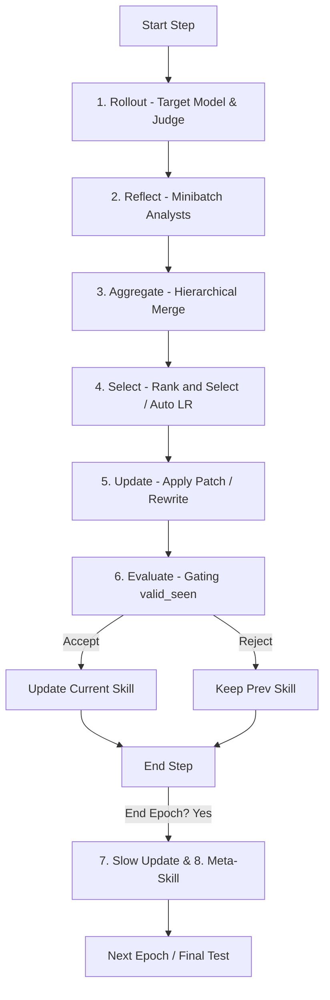

# SeePhys2025 Workflow Documentation

Tài liệu này mô tả chi tiết luồng làm việc (workflow) của môi trường **SeePhys2025** trong hệ thống **SkillOpt**, ghi rõ các thông số ở từng bước (nhận vào gì, trả ra các trường nào) và chi tiết các tham số khi gọi LLM.

---

## 1. Số Lượng Mẫu Dữ Liệu & Cách Phân Chia (Dataset Splits)

Hệ thống tải dữ liệu SeePhys-style physics vision QA từ HuggingFace Dataset trên đĩa thông qua `SeePhys2025DataLoader`.

*   **Tổng số mẫu gốc trong tập dữ liệu (`SeePhys_data`)**: **2.000 mẫu** (nằm trong split `train`).
*   **Tham số giới hạn và tỷ lệ phân chia mặc định** (từ `configs/SeePhys2025/default.yaml`):
    *   `env.limit`: `400` (giới hạn số mẫu nạp vào để xử lý).
    *   `env.split_ratio`: `"4:1:5"` (tỷ lệ Train : Val : Test).
    *   `env.split_seed`: `42`.

### Kết quả phân chia mẫu thực tế:

| Trường hợp | Tổng số mẫu xử lý | Tập Train | Tập Val (Selection) | Tập Test (Evaluation) |
| :--- | :--- | :--- | :--- | :--- |
| **Có Limit (Mặc định)** | **400** | **160** | **40** | **200** |
| **Không Limit (`limit=0`)** | **2.000** | **800** | **200** | **1.000** |

*   **Số lượng mẫu đánh giá Validation/Gating thực tế (`evaluation.sel_env_num`)**: **16 mẫu** (được lấy ngẫu nhiên từ tập Val).
*   **Số lượng mẫu đánh giá cuối cùng (`evaluation.test_env_num`)**: **32 mẫu** (được lấy ngẫu nhiên từ tập Test).

---

## 2. Cấu Trúc Dữ Liệu Một Mẫu Sau Chuẩn Hóa (`_normalize_item`)

Mỗi dòng dữ liệu sau khi đi qua DataLoader sẽ được chuẩn hóa thành một Dictionary với các trường sau:

*   `id` (*str*): ID của mẫu (ví dụ `"0"`, `"1"`...).
*   `index` (*int*): Chỉ số mẫu gốc.
*   `question` (*str*): Nội dung câu hỏi vật lý.
*   `answer` (*str*): Đáp án chuẩn (dạng plain text).
*   `answers` (*list[str]*): Danh sách chứa đáp án chuẩn để đối chiếu.
*   `ground_truth` (*str*): Bản sao của đáp án chuẩn.
*   `image_paths` / `images` (*list[str]*): Danh sách các đường dẫn cục bộ đến các file ảnh đã được giải mã và lưu cache (để tránh dependency decode lúc chạy).
*   `task_type` / `subtask` (*str*): Chủ đề vật lý của câu hỏi (trích xuất từ metadata).
*   `metadata` (*dict*): Chứa các thông tin bổ sung:
    *   `reasoning` (*str*): Lập luận giải thích đáp án (nếu có).
    *   `sig_figs` (*str*): Số chữ số có nghĩa mong muốn.
    *   `level` (*int*): Độ khó của câu hỏi.
    *   `subject` (*str*), `language` (*str*), `img_category` (*str*), `vision_relevance` (*str*), `caption` (*str*).

---

## 3. Luồng Làm Việc Chi Tiết (6-Stage Pipeline + Epoch Boundary Update)

Sơ đồ tổng quan của luồng huấn luyện cho mỗi step:



---

### BƯỚC 1: ROLLOUT (Chạy thử nghiệm)

Thực hiện suy diễn trên mô hình target bằng cách sử dụng nội dung **Skill hiện tại** để trả lời câu hỏi vật lý, sau đó so sánh kết quả bằng mô hình **Judge** (hoặc fallback exact match).

#### A. Target Model Inference
*   **Tham số nhận vào (Inputs)**:
    *   `item` (*dict*): Dictionary của mẫu dữ liệu.
    *   `skill_content` (*str*): Chuỗi văn bản markdown của skill hiện tại.
    *   `exec_timeout` (*int*): Giới hạn thời gian (mặc định 180s).
    *   `image_detail` (*str*): `"auto"`.
*   **Trường trả ra (Outputs)**:
    *   `response` (*str*): Văn bản phản hồi thô từ Target Model.
*   **Chi tiết Cuộc gọi LLM**:
    *   **Mô hình sử dụng**: `Qwen/Qwen3.6-27B` (Target backend: `qwen_chat`).
    *   **Max Completion Tokens**: `768` (ở lượt đầu tiên), `512` (ở các lượt tinh chỉnh tiếp theo nếu `max_turns > 1`).
    *   **Retries**: `5`.
    *   **System Prompt**:
        ```text
        You are a careful physics vision QA assistant. Use the provided skill and the attached images to answer the question. Reasoning is allowed, and you should state the final answer clearly in plain text. Do not rely on special tags for the answer.

        ## Skill
        {skill_content}
        ```
    *   **User Prompt**:
        Văn bản câu hỏi kèm các chỉ dẫn về format và các failure modes cần tránh, kèm các ảnh đính kèm dưới dạng multimodal `image_url` chứa base64 data-URI (`data:image/png;base64,...`).
        ```text
        ## Question
        {question}

        . Solve the question with image information.
        ## Answer Format
        - Reasoning is allowed, and the final answer should be stated directly in plain text.
        - Do not rely on special tags or JSON for the answer.
        - Keep the final answer concise and exact.

        ## Problem-Solving Strategy
        1. Identify the task type: direct reading, numerical computation, comparison, or interpretation.
        2. Look for the relevant part of the image: axes, labels, captions, equations, tables, or highlighted regions.
        3. Verify units and formatting before finalizing.
        4. Keep the answer concise and exact.

        ## Common Failure Modes to Avoid
        - Do not guess when the image evidence is insufficient.
        - Do not mix values from different images or different parts of the same image.
        - Do not drop units if the question expects them.
        - Do not paraphrase an exact value when the task asks for the exact value.
        - Do not bury the final answer in long reasoning.

        ## Final Response Template
        - Reasoning: brief internal reasoning as needed.
        - Final: your final answer here
        ```

#### B. Judge Model Evaluation
*   **Tham số nhận vào (Inputs)**:
    *   `question` (*str*): Câu hỏi gốc.
    *   `prediction_text` (*str*): Câu trả lời của Target Model.
    *   `gold_answers` (*list[str]*): Đáp án đúng.
*   **Trường trả ra (Outputs)**:
    *   `hard` (*int*): `0` hoặc `1` (1 nếu đúng hoàn toàn).
    *   `soft` (*float*): `0.0` hoặc `1.0` (giá trị bằng `hard` trong môi trường này).
    *   `reason` (*str*): Giải thích ngắn gọn lý do phán quyết từ Judge.
    *   `predicted_answer` (*str*): Đáp án dự đoán trích xuất từ văn bản thô.
    *   `gold_answers` (*list[str]*): Các đáp án chuẩn được đối sánh.
    *   `judge_text` (*str*): Phản hồi JSON thô của Judge.
*   **Chi tiết Cuộc gọi LLM (Judge)**:
    *   **Mô hình sử dụng**: `Qwen/Qwen3.6-27B` (Judge backend: `qwen_chat`).
    *   **Max Completion Tokens**: `256`.
    *   **Retries**: `3`.
    *   **System Prompt**:
        ```text
        You are a strict answer judge for SeePhys2025 physics vision QA. Compare the gold answer(s) with the model response and decide whether the model's final answer is acceptable. Treat mathematically equivalent answers as correct, even if formatting differs. Use the gold answer as the reference truth; do not invent a new answer. Return only a JSON object, with no markdown fences and no extra text. Use exactly this schema: {"hard": 0|1, "soft": 0|1, "reason": string}. Set hard and soft to the same value: 1 for acceptable/correct, 0 for unacceptable/wrong. Use reason to explain the decision briefly. Example expected response (return this JSON only): {"hard": 1, "soft": 1, "reason": "Numeric match and reasoning supports the result"}. Do NOT include any other text, explanations, or markdown fences — only the JSON object.
        ```
    *   **User Prompt**:
        ```text
        Judge the model response against the gold answer(s).

        {
          "question": "{question}",
          "gold_answers": {gold_answers},
          "model_response": "{prediction_text}"
        }

        Return only JSON in this exact shape: {"hard": 0|1, "soft": 0|1, "reason": string}. Do not wrap the JSON in markdown fences and do not add any surrounding prose. Judge both the reasoning and the final answer, and only mark correct when the reasoning supports the answer.
        ```
*   **Cơ chế dự phòng (Fallback)**:
    Nếu Judge trả về không đúng định dạng JSON hoặc bị lỗi API, hệ thống sẽ thực thi hàm Python cục bộ `_fallback_exact_match` để chuẩn hóa văn bản (chuyển chữ thường, xóa tất cả khoảng trắng, bỏ dấu `$` và dấu phẩy `,`) rồi so sánh trùng khớp tuyệt đối.

---

### BƯỚC 2: REFLECT (Phân tích & Phản hồi)

Hệ thống phân tách các quỹ đạo chạy thử nghiệm ở Bước 1 thành nhóm Thành công (`hard=1`) và Thất bại (`hard=0`), xáo trộn ngẫu nhiên, rồi chia nhỏ thành các minibatch kích thước `minibatch_size` (mặc định: `8`). Optimizer LLM sẽ phân tích song song từng minibatch để đề xuất sửa lỗi skill.

*   **Tham số nhận vào (Inputs)**:
    *   `results` (*list[dict]*): Các bản ghi kết quả của bước Rollout.
    *   `skill_content` (*str*): Nội dung skill hiện tại.
    *   `prediction_dir` (*str*): Thư mục lưu vết logs.
    *   `patches_dir` (*str*): Thư mục ghi các file patch đề xuất.
    *   `minibatch_size` (*int*): `8`.
    *   `edit_budget` (*int*): `4` (L - số lượng chỉnh sửa tối đa cho phép).
    *   `step_buffer_context` (*str*): Lịch sử lỗi và các thay đổi bị từ chối từ các step trước trong cùng epoch.
    *   `meta_skill_context` (*str*): Optimizer memory từ epoch trước.
    *   `update_mode` (*str*): `"patch"` (hoặc `"rewrite_from_suggestions"`, `"full_rewrite"`).
*   **Trường trả ra (Outputs)**:
    *   Một file JSON đại diện cho patch (`minibatch_fail_*.json` hoặc `minibatch_succ_*.json`) chứa:
        *   `batch_size` (*int*): Số lượng mẫu trong minibatch.
        *   `failure_summary` (*list[dict]*): Tóm tắt loại lỗi (`failure_type`, `count`, `description`).
        *   `patch` (*dict*): Chứa `reasoning` và danh sách `edits` (các phép chỉnh sửa đề xuất: `append`, `insert_after`, `replace`, `delete`).
*   **Chi tiết Cuộc gọi LLM**:
    *   **Mô hình sử dụng**: `Qwen/Qwen3.6-27B` (Optimizer backend).
    *   **Max Completion Tokens**: `4096` (nếu dùng chế độ update `patch`), `64000` (nếu dùng chế độ update `full_rewrite`).
    *   **Retries**: `3`.
    *   **System Prompt**: Đọc từ file prompt tương ứng, ví dụ với nhóm lỗi: `analyst_error.md` (yêu cầu phân tích lỗi hệ thống và đưa ra chỉnh sửa tổng quát hóa tốt nhất, tránh hardcode, bảo vệ vùng slow-update).
    *   **User Prompt (Đa phương thức - Multimodal)**:
        *   Phần text:
            ```text
            ## Current Skill
            {skill_content}

            ## Edits Budget
            Produce at most L={edit_budget} edits.

            ## Previous Steps in This Epoch
            {step_buffer_context}

            ## Optimizer Meta Skill
            {meta_skill_context}

            ## Failed Trajectories (8 total)
            ### Trajectory 1 (id=...)
            Task: {question}
            Task type: {task_type}
            Failure reason: {fail_reason}
            Steps: 1
            #### Target System Prompt
            ...
            #### Target User Prompt
            ...
            [Lịch sử hội thoại thô từ rollout]
            ...
            ```
        *   Phần ảnh: Các ảnh tương ứng của từng mẫu trong minibatch được đính kèm trực tiếp dưới dạng ảnh multimodal (`{"type": "image_url", "image_url": ...}`).

---

### BƯỚC 3: AGGREGATE (Gộp đề xuất)

Thực hiện gộp phân cấp (hierarchical merge) song song các patch của nhóm lỗi (Failure patches) và nhóm thành công (Success patches) bằng LLM thành một patch tổng hợp duy nhất. Ưu tiên sửa lỗi hơn tối ưu hóa thành công.

*   **Tham số nhận vào (Inputs)**:
    *   `skill_content` (*str*): Nội dung skill hiện tại.
    *   `failure_patches` (*list[dict]*): Các patch thu được từ các minibatch lỗi.
    *   `success_patches` (*list[dict]*): Các patch từ các minibatch thành công.
    *   `batch_size` (*int*): `8` (số lượng patch gộp cùng lúc trong 1 batch song song).
    *   `update_mode` (*str*): `"patch"`.
    *   `meta_skill_context` (*str*): Optimizer memory.
*   **Trường trả ra (Outputs)**:
    *   Một JSON patch thống nhất chứa:
        *   `reasoning` (*str*): Lập luận gộp.
        *   `edits` (*list[dict]*): Danh sách các chỉnh sửa sau khi lọc trùng và giải quyết mâu thuẫn.
*   **Chi tiết Cuộc gọi LLM**:
    *   **Mô hình sử dụng**: `Qwen/Qwen3.6-27B` (Optimizer backend).
    *   **Max Completion Tokens**: `4096` (hoặc `64000` cho chế độ full rewrite).
    *   **Retries**: `3`.
    *   **System Prompt**: Đọc từ `merge_failure.md`, `merge_success.md`, hoặc `merge_final.md` tương ứng với cấp độ gộp.
    *   **User Prompt**:
        ```text
        ## Current Skill
        {skill_content}

        ## Patches to merge (N total, merge level X)
        [Danh sách JSON của các patch cần gộp]
        ```

---

### BƯỚC 4: SELECT (Lựa chọn & Xếp hạng)

Nếu số lượng đề xuất chỉnh sửa vượt quá ngân sách `max_edits` (edit budget), hệ thống gọi LLM Ranker để xếp hạng mức độ ưu tiên và lọc ra đúng số lượng tối đa cho phép.

*   **Tham số nhận vào (Inputs)**:
    *   `skill_content` (*str*): Skill hiện tại.
    *   `patch` (*dict*): Patch tổng hợp thu được từ bước Aggregate.
    *   `max_edits` (*int*): Số lượng thay đổi tối đa được phép áp dụng (do Scheduler hoặc Autonomous LR quyết định).
    *   `update_mode` (*str*): `"patch"`.
    *   `meta_skill_context` (*str*): Optimizer memory.
*   **Trường trả ra (Outputs)**:
    *   Patch đã rút gọn chỉ chứa tối đa `max_edits` thay đổi kèm theo `ranking_details`.
*   **Chi tiết Cuộc gọi LLM**:
    *   **Mô hình sử dụng**: `Qwen/Qwen3.6-27B` (Optimizer backend).
    *   **Max Completion Tokens**: `2048`.
    *   **Retries**: `3`.
    *   **System Prompt**: Đọc từ file `ranking.md` (hoặc `ranking_rewrite.md`).
    *   **User Prompt**:
        ```text
        ## Current Skill
        {skill_content}

        ## Edits Pool (N edits, budget=L)
        [0] Op: Replace, Target: "...", Content: "..."
        [1] Op: Append, Content: "..."
        ...

        Select the L most important edits. Return their 0-based indices in priority order.
        ```
*   **Phản hồi trả về của LLM**: JSON dạng `{"selected_indices": [index_1, index_2, ...]}`.
*   **Fallback**: Nếu LLM lỗi, hệ thống tự động cắt bớt danh sách (truncation) lấy các phần tử đầu tiên.

---

### BƯỚC 5: UPDATE (Cập nhật)

Hệ thống áp dụng các đề xuất chỉnh sửa đã chọn vào văn bản Skill hiện tại.
*   **Trong chế độ `patch`**: Áp dụng trực tiếp bằng code Python thông qua các hàm regex xử lý `append`, `insert_after`, `replace`, `delete`.
*   **Trong chế độ `rewrite_from_suggestions`**: Gọi LLM để viết lại toàn bộ skill dựa trên các gợi ý đã lọc.
*   **Chi tiết Cuộc gọi LLM (Chỉ cho chế độ Rewrite)**:
    *   **Mô hình sử dụng**: `Qwen/Qwen3.6-27B` (Optimizer backend).
    *   **Max Completion Tokens**: `64000` (hoặc `rewrite_max_completion_tokens`).
    *   **Retries**: `3`.
    *   **System Prompt**: Đọc từ `rewrite_skill.md`.
    *   **User Prompt**:
        ```text
        ## Current Skill
        {skill_content}

        ## Selected Revise Suggestions (L total)
        [Danh sách các gợi ý sửa đổi dạng JSON]

        Rewrite the full skill document so it integrates the selected suggestions. Return the complete new skill in `new_skill`.
        ```
    *   **Trường trả ra**: JSON dạng `{"new_skill": "nội dung markdown skill mới", "change_summary": [...]}`.

---

### BƯỚC 6: EVALUATE (Đánh giá & Gating)

Thực hiện Rollout đánh giá skill ứng viên mới (`candidate_skill`) trên **tập Selection** (16 mẫu ngẫu nhiên từ Val split).
*   Tính toán điểm số `cand_hard` và `cand_soft`.
*   Thực thi hàm `evaluate_gate` so sánh điểm:
    *   Nếu `cand_hard` $>$ `best_score` (tốt nhất lịch sử): Chấp nhận skill ứng viên, đánh dấu là `accept_new_best` và cập nhật `best_skill.md`.
    *   Nếu `cand_hard` $>$ `current_score` (tốt hơn skill hiện tại của epoch): Chấp nhận skill ứng viên, đánh dấu là `accept`.
    *   Nếu `cand_hard` $\le$ `current_score`: Từ chối skill ứng viên, đánh dấu là `reject` và giữ nguyên skill hiện tại.

---

## 4. Các Bước Cuối Epoch (Epoch-Boundary Optimization)

Cuối mỗi epoch, hệ thống thực hiện hai luồng tối ưu hóa dài hạn:

### A. Slow Update (Cập nhật dọc)
*   **Hàm thực hiện**: `run_slow_update` trong `slow_update.py`
*   **Mục đích**: So sánh hiệu năng của cùng $20$ mẫu huấn luyện (`slow_update_samples`) giữa skill cuối epoch trước vs skill cuối epoch hiện tại nhằm sinh ra chỉ dẫn chung dài hạn, ghi đè vào vùng được bảo vệ (`<!-- SLOW_UPDATE_START -->` và `<!-- SLOW_UPDATE_END -->`). Vùng này không thể bị sửa bởi các bước huấn luyện thường nhật ở step-level.
*   **Chi tiết Cuộc gọi LLM**:
    *   **Mô hình sử dụng**: `Qwen/Qwen3.6-27B` (Optimizer backend).
    *   **Max Completion Tokens**: `4096`.
    *   **Retries**: `3`.
    *   **System Prompt**: Đọc từ file `slow_update.md`.
    *   **User Prompt**:
        ```text
        ## Previous Epoch's Skill
        {prev_skill}
        ## Current Epoch's Skill
        {current_skill}
        ## Previous Slow Update Guidance
        {prev_guidance}
        ## Longitudinal Comparison (same 20 tasks, two skill versions)
        [Kết quả so sánh chi tiết 20 mẫu: phân loại regressed, persistent_fail, improved, stable_success kèm logs hội thoại thô]
        ```
    *   **Trường trả ra**: JSON dạng `{"reasoning": "...", "slow_update_content": "nội dung chỉ dẫn mới"}`.

### B. Meta-Skill Update (Cập nhật Optimizer Memory)
*   **Hàm thực hiện**: `run_meta_skill` trong `meta_skill.py`
*   **Mục đích**: Chạy phân tích để sinh ra các hướng dẫn tự sửa đổi cho chính mô hình Optimizer LLM ở các epoch sau (không sửa đổi nội dung skill).
*   **Chi tiết Cuộc gọi LLM**:
    *   **Mô hình sử dụng**: `Qwen/Qwen3.6-27B` (Optimizer backend).
    *   **Max Completion Tokens**: `3072`.
    *   **Retries**: `3`.
    *   **System Prompt**: Đọc từ file `meta_skill.md`.
    *   **User Prompt**:
        ```text
        ## Previous Epoch Last-Step Skill
        {prev_skill}
        ## Current Epoch Last-Step Skill
        {current_skill}
        ## Previous Optimizer Meta Skill
        {prev_meta_skill}
        ## Longitudinal Comparison (same tasks, two last-step skills)
        [Kết quả đối sánh hiệu năng các mẫu]
        ```
    *   **Trường trả ra**: JSON dạng `{"reasoning": "...", "meta_skill_content": "nội dung hướng dẫn optimizer mới"}`.
